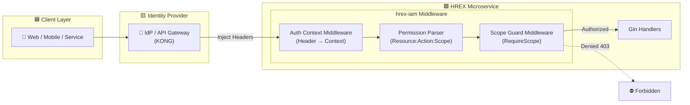

hrex-iam
------------------------------------------

**Identity & Access Management (IAM) middleware and policy engine for HREX microservices**

`hrex-iam` is a shared Go library providing **authentication context injection** and **authorization enforcement (RBAC + Scope-based / PBAC)** for all HREX services.

It standardizes how services:

- Identify callers (user, tenant, org unit)
- Parse and propagate permission scopes
- Enforce resource & action permissions
- Implement policy guards consistently across the platform

Designed for **Gin-based microservices**, with framework-agnostic core modules for future expansion.

---

## ✨ Features

- ✅ Authentication Context Middleware
- ✅ Header-based identity propagation
- ✅ Permission & Scope model (`Resource:Action:Scope`)
- ✅ Scope enforcement middleware for Gin
- ✅ Clean & portable policy engine core
- ✅ Configurable ignored routes
- ✅ Distributed-friendly (Stateless)
- ✅ Production-ready

---


## Architecture




## 📦 Installation

```bash
go get github.com/extosoft-devsecops/hrex-iam@latest
```

