hrex-iam
------------------------------------------

**Identity & Access Management (IAM) middleware and policy engine for HREX microservices**

`hrex-iam` is a shared Go library providing **authentication context injection** and **authorization enforcement (RBAC + Scope-based / PBAC)** for all HREX services.

It standardizes how services:

- Identify callers (user, tenant, org unit)
- Parse and propagate permission scopes
- Enforce resource & action permissions
- Implement policy guards consistently across the platform

Designed for **Gin-based microservices**, with framework-agnostic core modules for future expansion.

---

## ✨ Features

- ✅ Authentication Context Middleware
- ✅ Header-based identity propagation
- ✅ Permission & Scope model (`Resource:Action:Scope`)
- ✅ Scope enforcement middleware for Gin
- ✅ Clean & portable policy engine core
- ✅ Configurable ignored routes
- ✅ Distributed-friendly (Stateless)
- ✅ Production-ready

---


## Architecture

```mermaid
flowchart LR

%% ========= CLIENT LAYER ==========
subgraph C["🟦 Client Layer"]
U["👤 Web / Mobile / Service"]
end

%% ========= IDENTITY LAYER ==========
subgraph I["🟨 Identity Provider"]
IDP["🔐 IdP / API Gateway<br/>(KONG)"]
end

%% ========= SERVICE LAYER ==========
subgraph S["🟩 HREX Microservice"]

subgraph M["hrex-iam Middleware"]
A1["Auth Context Middleware<br/>(Header → Context)"]
A2["Permission Parser<br/>(Resource:Action:Scope)"]
A3["Scope Guard Middleware<br/>(RequireScope)"]
end

H["Gin Handlers"]
end

%% ========= FLOW ==========
U --> IDP
IDP -->|Inject Headers| A1
A1 --> A2
A2 --> A3
A3 -->|Authorized| H
A3 -.->|Denied 403| X["⛔ Forbidden"]
```




## 📦 Installation

```bash
go get github.com/extosoft-devsecops/hrex-iam@latest
```

